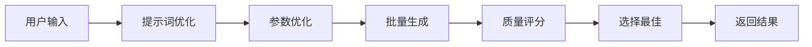

# EasyDrawer 开发文档

## 项目架构

### 核心模块

```
src/
├── agent/              # LangGraph工作流
│   └── workflow.py    # Agent状态机编排
├── services/          # 核心服务
│   ├── prompt_optimizer.py      # 提示词优化（Claude）
│   ├── parameter_optimizer.py   # 参数智能调优
│   ├── sd_client.py             # SD API客户端
│   └── quality_scorer.py        # 图片质量评分
├── api/               # FastAPI接口
│   └── main.py
├── models/            # 数据模型
│   └── schemas.py
└── config.py          # 配置管理
```

### 工作流程



## 核心算法

### 1. 提示词优化引擎

**位置**: `src/services/prompt_optimizer.py`

**原理**:
- 使用Claude Sonnet 4.6分析用户意图
- 识别场景类型（人像/风景/产品/艺术/建筑）
- 自动扩展质量增强词（光影、构图、质感）
- 添加风格特定词汇
- 生成负面提示词排除常见缺陷

**示例**:
```python
输入: "一只猫"
输出: "a fluffy persian cat, sitting gracefully, soft fur texture, 
       studio lighting, professional pet photography, shallow depth 
       of field, bokeh background, 8k uhd, highly detailed, masterpiece"
```

### 2. 参数智能调优

**位置**: `src/services/parameter_optimizer.py`

**策略表**:

| 场景类型 | Steps | CFG Scale | Sampler | 说明 |
|---------|-------|-----------|---------|------|
| Portrait | 30 | 7.0 | DPM++ 2M | 平滑皮肤，中等CFG |
| Landscape | 40 | 9.0 | Euler a | 自然场景，高CFG |
| Artistic | 50 | 12.0 | DDIM | 艺术感，更多步数 |
| Product | 35 | 8.0 | DPM++ 2M Karras | 平衡细节 |

**风格微调**:
- Realistic: CFG -1.0（避免过度风格化）
- Artistic: CFG +2.0, Steps +10
- Anime: CFG +1.0

### 3. 质量评估系统

**位置**: `src/services/quality_scorer.py`

**评分维度**:
1. **CLIP相似度** (40%): 提示词与图片匹配度
2. **美学评分** (40%): 构图、色彩、清晰度
3. **技术质量** (20%): 分辨率、亮度、对比度

**评分范围**: 0-100

### 4. LangGraph状态机

**位置**: `src/agent/workflow.py`

**节点**:
1. `optimize_prompt`: 提示词优化
2. `optimize_parameters`: 参数调优
3. `generate_images`: 批量生成（默认3张）
4. `score_images`: 质量评分
5. `select_best`: 选择最佳结果

**特性**:
- ✅ 状态持久化（Checkpoint）
- ✅ 断点续传
- ✅ 人工审核节点（可扩展）
- ✅ 完整日志追踪

## API使用

### 生成图片

```bash
POST /generate
Content-Type: application/json

{
  "prompt": "一只猫",
  "style": "realistic",  # realistic/artistic/anime/concept_art/portrait/landscape
  "width": 1024,
  "height": 1024,
  "negative_prompt": "ugly",  # 可选
  "session_id": "xxx"  # 可选，用于多轮对话
}
```

**响应**:
```json
{
  "session_id": "uuid",
  "optimized_prompt": {
    "original": "一只猫",
    "enhanced": "a fluffy persian cat...",
    "negative": "lowres, bad anatomy...",
    "scene_type": "portrait",
    "style": "realistic",
    "reasoning": "识别为宠物肖像场景..."
  },
  "images": [...],  # 所有候选图片
  "best_image": {
    "image_data": "base64...",
    "seed": 123456,
    "quality_score": 87.5,
    "parameters": {...}
  },
  "generation_time": 45.2
}
```

### 仅优化提示词

```bash
POST /optimize-prompt?prompt=一只猫&style=realistic
```

## 配置说明

### 环境变量 (.env)

```bash
# LLM配置
ANTHROPIC_API_KEY=sk-ant-xxx
LLM_MODEL=claude-sonnet-4.6

# SD配置
SD_API_URL=http://localhost:7860  # SD WebUI地址
SD_API_KEY=                        # 如使用Stability AI API则需要
SD_BATCH_SIZE=3                    # 每次生成数量

# 应用配置
DEBUG=true
LOG_LEVEL=INFO
```

### Stable Diffusion设置

**本地部署 (推荐)**:
1. 安装SD WebUI
2. 启动时添加`--api`参数
3. 设置`SD_API_URL=http://localhost:7860`

**使用Stability AI API**:
1. 获取API Key
2. 设置`SD_API_URL=https://api.stability.ai/v2beta`
3. 设置`SD_API_KEY=your_key`

## 扩展开发

### 添加新的风格

1. 在`data/prompts/quality_enhancers.json`添加风格词:
```json
{
  "cyberpunk": [
    "neon lights",
    "futuristic",
    "dark atmosphere"
  ]
}
```

2. 在`src/models/schemas.py`添加枚举:
```python
class ImageStyle(str, Enum):
    CYBERPUNK = "cyberpunk"
```

3. 在`src/services/parameter_optimizer.py`添加参数:
```python
STYLE_ADJUSTMENTS = {
    ImageStyle.CYBERPUNK: {"cfg_scale": +2.0, "steps": +5}
}
```

### 添加人工审核节点

```python
# 在workflow.py中添加
workflow.add_node("human_review", self._human_review)
workflow.add_edge("optimize_prompt", "human_review")
workflow.add_edge("human_review", "optimize_parameters")

# 标记为中断点
workflow.compile(checkpointer=memory, interrupt_before=["human_review"])
```

### 集成真实评分模型

替换`src/services/quality_scorer.py`中的mock方法:

```python
def _load_models(self):
    import open_clip
    self.clip_model, _, self.preprocess = open_clip.create_model_and_transforms(
        'ViT-B-32', pretrained='openai'
    )
    # 加载美学评分模型
```

## 性能优化

### 并发控制

```python
# config.py
max_concurrent_generations: int = 3  # 限制同时生成的任务数
```

### 缓存策略

- 提示词优化结果缓存（TODO）
- 常用参数预热（TODO）
- Redis会话管理（TODO）

### 批处理

```python
# 增加batch_size提高效率（需要更多显存）
SD_BATCH_SIZE=5  # 一次生成5张
```

## 故障排查

### SD API连接失败

```bash
# 检查SD WebUI是否启动
curl http://localhost:7860/sdapi/v1/sd-models

# 确认启动时带了--api参数
./webui.sh --api
```

### Claude API超时

```python
# 增加超时时间
llm_max_tokens: int = 3000  # 提高token限制
```

### 内存不足

```python
# 减少batch_size
SD_BATCH_SIZE=1

# 或降低分辨率
width: int = 768
height: int = 768
```

## 下一步计划

- [ ] 多轮对话优化（记住用户偏好）
- [ ] 用户偏好学习（风格、色调、构图）
- [ ] 图生图支持
- [ ] ControlNet集成（精确控制）
- [ ] 批量任务队列
- [ ] Web前端界面
- [ ] 集成真实CLIP评分模型
- [ ] 数据库持久化（会话历史）
